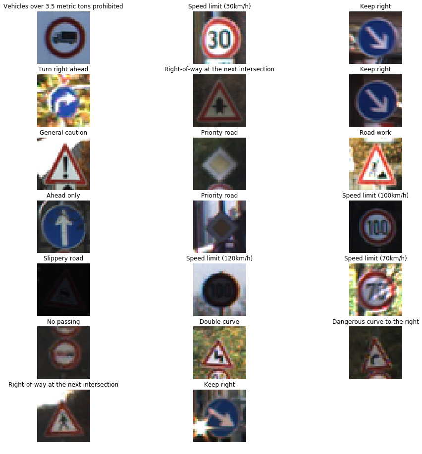
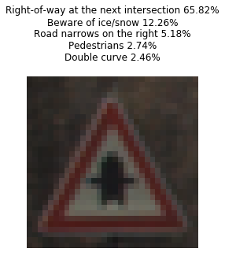
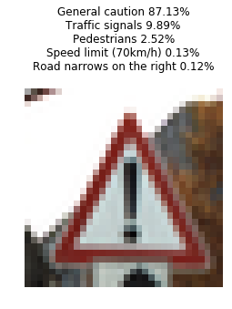
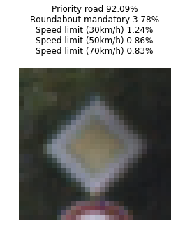
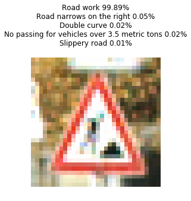

# Project: Traffic Sign Recognition Classifier
## Step 0: Load The Data


```python
# Load pickled data
import pickle
import numpy as np

# TODO: Fill this in based on where you saved the training and testing data

training_file = "data-set/train.p"
validation_file="data-set/valid.p"
testing_file = "data-set/test.p"

with open(training_file, mode='rb') as f:
    train = pickle.load(f)
with open(validation_file, mode='rb') as f:
    valid = pickle.load(f)
with open(testing_file, mode='rb') as f:
    test = pickle.load(f)
    
X_train_orig, y_train_orig = train['features'], train['labels']
X_valid_orig, y_valid_orig = valid['features'], valid['labels']
X_test_orig, y_test_orig = test['features'], test['labels']

print (len(X_train_orig),len(y_train_orig))
print (X_valid_orig[0].shape)
```

    34799 34799
    (32, 32, 3)


---

## Step 1: Dataset Summary & Exploration

The pickled data is a dictionary with 4 key/value pairs:

- `'features'` is a 4D array containing raw pixel data of the traffic sign images, (num examples, width, height, channels).
- `'labels'` is a 1D array containing the label/class id of the traffic sign. The file `signnames.csv` contains id -> name mappings for each id.
- `'sizes'` is a list containing tuples, (width, height) representing the original width and height the image.
- `'coords'` is a list containing tuples, (x1, y1, x2, y2) representing coordinates of a bounding box around the sign in the image. **THESE COORDINATES ASSUME THE ORIGINAL IMAGE. THE PICKLED DATA CONTAINS RESIZED VERSIONS (32 by 32) OF THESE IMAGES**

### Provide a Basic Summary of the Data Set Using Python, Numpy and/or Pandas


```python
### Data exploration visualization code goes here.
### Feel free to use as many code cells as needed.

n_train = X_train_orig.shape[0]
n_validation = X_valid_orig.shape[0]
n_test = X_test_orig.shape[0]

image_shape = (X_train_orig.shape[1],X_train_orig.shape[2])
n_classes = np.unique(y_train_orig).size

print("Number of training examples =", n_train)
print("Number of testing examples =", n_test)
print("Image data shape =", image_shape)
print("Number of classes =", n_classes)
```

    Number of training examples = 34799
    Number of testing examples = 12630
    Image data shape = (32, 32)
    Number of classes = 43


### Include an exploratory visualization of the dataset

```python
### Data exploration visualization code goes here.
### Feel free to use as many code cells as needed.
import matplotlib.pyplot as plt
import random

# Visualizations will be shown in the notebook.
%matplotlib inline
plt.figure(figsize=(image_shape[0]/3,image_shape[1]/3))
counts=[0]*n_classes
for i in range(0, n_classes):
    plt.subplot(6, 8, i+1)
    pics = X_train_orig[y_train_orig == i]
    index = random.randint(0, len(pics))
    plt.imshow(pics[index].squeeze())
    plt.title(i)
    plt.axis('off')
    counts[i]=len(pics)
plt.show()

plt.figure(figsize=(10,3))
plt.bar(range(0, n_classes), counts)
plt.title("Count of each sign")
plt.xlabel("Traffic sign index")
plt.ylabel("Size")
plt.show()
```


----

## Step 2: Design and Test a Model Architecture
### Pre-process the Data Set (normalization, grayscale, etc.)

```python
### Preprocessing

from sklearn.model_selection import train_test_split
from sklearn import preprocessing
from sklearn.utils import shuffle
def normalize(data):
    return (data - 128.) / 128.

def label_binarizer(labels):
    lb = preprocessing.LabelBinarizer()
    lb.fit(labels)
    return lb

def preprocess(x_train, y_train, x_test, y_test):
    # Normalize
    x_train = normalize(x_train)
    x_test = normalize(x_test)
    
    # One hot encode labels
    lb = label_binarizer(y_train)
    y_train = lb.transform(y_train)
    y_test = lb.transform(y_test)
    
    # Split training set to training and validation
    x_train, x_val, y_train, y_val = \
        train_test_split(x_train, y_train, 
                         test_size=0.33, stratify = y_train ) 
    return x_train, y_train, x_test, y_test, x_val, y_val

X_train, y_train, X_test, y_test, X_val, y_val = \
preprocess(X_train_orig, y_train_orig, \
           X_test_orig, y_test_orig)

```

### Model Architecture


```python
### Define your architecture here.
### Feel free to use as many code cells as needed.

from tensorflow.contrib.layers import flatten
import tensorflow as tf

def LeNet(x, keep_prob): 
    # Arguments used for tf.truncated_normal, randomly defines variables for the weights and biases for each layer
    mu = 0
    sigma = 0.01
    
    # Layer 1: Convolutional. Input = 32x32x1. Output = 28x28x6.
    conv1_W = tf.Variable(tf.truncated_normal(shape=(5, 5, 3, 6), mean = mu, stddev = sigma))
    conv1_b = tf.Variable(tf.zeros(6))
    conv1   = tf.nn.conv2d(x, conv1_W, strides=[1, 1, 1, 1], padding='VALID') + conv1_b

    # Activation.
    conv1 = tf.nn.relu(conv1)
    conv1 = tf.nn.dropout(conv1, keep_prob)

    # Pooling. Input = 28x28x6. Output = 14x14x6.
    conv1 = tf.nn.max_pool(conv1, ksize=[1, 2, 2, 1], strides=[1, 2, 2, 1], padding='VALID')

    # Layer 2: Convolutional. Output = 10x10x16.
    conv2_W = tf.Variable(tf.truncated_normal(shape=(5, 5, 6, 16), mean = mu, stddev = sigma))
    conv2_b = tf.Variable(tf.zeros(16))
    conv2   = tf.nn.conv2d(conv1, conv2_W, strides=[1, 1, 1, 1], padding='VALID') + conv2_b
    
    # Activation.
    conv2 = tf.nn.relu(conv2)
    conv2 = tf.nn.dropout(conv2, keep_prob)

    # Pooling. Input = 10x10x16. Output = 5x5x16.
    conv2 = tf.nn.max_pool(conv2, ksize=[1, 2, 2, 1], strides=[1, 2, 2, 1], padding='VALID')

    # Flatten. Input = 5x5x16. Output = 400.
    fc0   = flatten(conv2)
    
    # Layer 3: Fully Connected. Input = 400. Output = 120.
    fc1_W = tf.Variable(tf.truncated_normal(shape=(400, 120), mean = mu, stddev = sigma))
    fc1_b = tf.Variable(tf.zeros(120))
    fc1   = tf.matmul(fc0, fc1_W) + fc1_b
    
    # Activation.
    fc1    = tf.nn.relu(fc1)
    fc1 = tf.nn.dropout(fc1, keep_prob)

    # Layer 4: Fully Connected. Input = 120. Output = 43.
    fc2_W  = tf.Variable(tf.truncated_normal(shape=(120, n_classes), mean = mu, stddev = sigma))
    fc2_b  = tf.Variable(tf.zeros(n_classes))
    logits = tf.matmul(fc1, fc2_W) + fc2_b
    
    return logits
```


```python
x = tf.placeholder(tf.float32, (None, 32, 32, 3))
y = tf.placeholder(tf.float32, (None, n_classes))
keep_prob = tf.placeholder(tf.float32)

logits = LeNet(x,keep_prob)

loss_op = tf.reduce_mean(tf.nn.softmax_cross_entropy_with_logits(logits, y))
opt = tf.train.AdamOptimizer(learning_rate=0.001) 
train_op = opt.minimize(loss_op)
correct_prediction = tf.equal(tf.argmax(logits, 1), tf.argmax(y, 1))
accuracy_op = tf.reduce_mean(tf.cast(correct_prediction, tf.float32))
saver = tf.train.Saver()
```


```python
def next_batch(x_data, y_data, batch_size, step):
    batch_start = step*batch_size
    batch_x = x_data[batch_start:batch_start + batch_size]
    batch_y = y_data[batch_start:batch_start + batch_size]
    return batch_x, batch_y

def eval_data(x_data, y_data):
    steps_per_epoch = len(x_data) // BATCH_SIZE
    num_examples = steps_per_epoch * BATCH_SIZE
    total_acc, total_loss = 0, 0
    for step in range(steps_per_epoch):
        batch_x, batch_y = next_batch(x_data, y_data, BATCH_SIZE, step)
        loss, acc = sess.run([loss_op, accuracy_op], feed_dict={x: batch_x, y: batch_y, keep_prob: 1.0})
        total_acc += (acc * batch_x.shape[0])
        total_loss += (loss * batch_x.shape[0])
    return total_loss/num_examples, total_acc/num_examples
```

### Train, Validate and Test the Model

A validation set can be used to assess how well the model is performing. A low accuracy on the training and validation
sets imply underfitting. A high accuracy on the training set but low accuracy on the validation set implies overfitting.


```python
EPOCHS = 10
BATCH_SIZE = 50

prob_step=(1.0-0.5)/EPOCHS
prob=1.0
with tf.Session() as sess:
    sess.run(tf.global_variables_initializer())
    steps_per_epoch = len(X_train) // BATCH_SIZE
    num_examples = steps_per_epoch * BATCH_SIZE

    for i in range(EPOCHS):
        for step in range(steps_per_epoch):
            batch_x, batch_y = next_batch(X_train, y_train, BATCH_SIZE, step)
            loss = sess.run(train_op, \
                            feed_dict={x: batch_x, y: batch_y, keep_prob: prob})

        val_loss, val_acc = eval_data(X_val, y_val)
        print("EPOCH {} keep_prob {:.2f} loss = {:.3f} accuracy = {:.3f}".
              format(i+1,prob, val_loss, val_acc))
        prob-=prob_step
        saver.save(sess, './lenet')
        
    # Evaluate on the test data
    test_loss, test_acc = eval_data(X_test, y_test)
    print()
    print("Testing model loss = {:.3f} accuracy = {:.3f}".format(test_loss, test_acc))
```

    EPOCH 1 keep_prob 1.00 loss = 1.877 accuracy = 0.413
    EPOCH 2 keep_prob 0.95 loss = 0.897 accuracy = 0.724
    EPOCH 3 keep_prob 0.90 loss = 0.559 accuracy = 0.844
    EPOCH 4 keep_prob 0.85 loss = 0.428 accuracy = 0.896
    EPOCH 5 keep_prob 0.80 loss = 0.378 accuracy = 0.920
    EPOCH 6 keep_prob 0.75 loss = 0.356 accuracy = 0.934
    EPOCH 7 keep_prob 0.70 loss = 0.373 accuracy = 0.936
    EPOCH 8 keep_prob 0.65 loss = 0.400 accuracy = 0.934
    EPOCH 9 keep_prob 0.60 loss = 0.459 accuracy = 0.937
    EPOCH 10 keep_prob 0.55 loss = 0.530 accuracy = 0.930
    
    Testing model loss = 0.720 accuracy = 0.856


```python
# Evaluate again for comparing multiple runs
with tf.Session() as sess:
    saver.restore(sess, tf.train.latest_checkpoint('.'))
    test_loss, test_acc = eval_data(X_test, y_test)
    print()
    print("Testing model loss = {:.3f} accuracy = {:.3f}".format(test_loss, test_acc))
```

    
    Testing model loss = 0.734 accuracy = 0.859


---

## Step 3: Test a Model on New Images

### Load and Output the Images


```python
### Load the images and plot them here.
### Feel free to use as many code cells as needed.
import os
import matplotlib.image as mpimg
import PIL
from PIL import Image

path = "GTSRB/Final_Test/Images/"
files = [file for file in os.listdir(path) if file.endswith('.ppm')]
files = sorted(files)
files = files[0:1000]
signs = np.empty((0,32,32,3))
file_num=len(files)

for file in files:
    img = Image.open(path + file)
    img_resized = img.resize((32,32), PIL.Image.ANTIALIAS)
    img_array=np.array(img_resized.getdata()).\
                reshape(img_resized.size[0], img_resized.size[1], 3)
    signs = np.append(signs, [img_array], axis=0)

print("Loaded ",file_num, "files")
print("Showing the first 20 pictures")


plt.figure(figsize=(image_shape[0]/3,image_shape[1]/3))
image_list=[]
for i in range(0,20) :
    img = Image.open(path + files[i])
    img_resized = img.resize((32,32), PIL.Image.ANTIALIAS)
    image_list.append(img_resized)
    plt.subplot(4, 5, i+1)
    plt.title(files[i])
    plt.imshow(img_resized)
    plt.axis('off')
plt.show()
```

    Loaded  1000 files
    Showing the first 20 pictures


### Predict the Sign Type for Each Image


```python
### Run the predictions here and use the model to output the prediction for each image.
### Make sure to pre-process the images with the same pre-processing pipeline used earlier.
### Feel free to use as many code cells as needed.
csv_data = np.genfromtxt('signnames.csv', delimiter=',', names=True, dtype=None)
sign_names = [t[1].decode('utf-8') for t in csv_data]

signs_norm = normalize(signs)
predicions = tf.argmax(logits,1)
predicted_classes = []

with tf.Session() as sess:
    saver.restore(sess, tf.train.latest_checkpoint('.'))
    predicted_classes = sess.run(predicions, feed_dict={x: signs_norm, keep_prob: 1.0})

print("Tested against ",len(predicted_classes),"files")
plt.figure(figsize=(image_shape[0]/3,image_shape[1]/3))
for i in range(0,20):
    plt.subplot(7, 3, i+1)
    plt.title(sign_names[predicted_classes[i]])
    plt.axis('off')
    plt.imshow(image_list[i])
plt.show()
```

    Tested against  1000 files





### Analyze Performance


```python
### Calculate the accuracy for these 5 new images. 
### For example, if the model predicted 1 out of 5 signs correctly, it's 20% accurate on these new images.
csv_data = np.genfromtxt('GTSRB/Final_Test/GT-final_test.csv', \
                         delimiter=';', names=True, dtype=None)
label_indexed= [l[7] for l in csv_data]
for i in range(0,20):
    print(predicted_classes[i],"\t",label_indexed[i],"\t",\
          sign_names[label_indexed[i]])
    
correct_predicts=0
for predict,label in zip(predicted_classes,label_indexed):
    if predict==label:
        correct_predicts+=1
        
print()
print("Correct predict: ",correct_predicts)
print("Total test: ",file_num)
print("Accuracy: ",1.0* correct_predicts/file_num)
```

    16 	 16 	 Vehicles over 3.5 metric tons prohibited
    1 	 1 	 Speed limit (30km/h)
    38 	 38 	 Keep right
    33 	 33 	 Turn right ahead
    11 	 11 	 Right-of-way at the next intersection
    38 	 38 	 Keep right
    18 	 18 	 General caution
    12 	 12 	 Priority road
    25 	 25 	 Road work
    35 	 35 	 Ahead only
    12 	 12 	 Priority road
    7 	 7 	 Speed limit (100km/h)
    23 	 23 	 Slippery road
    8 	 7 	 Speed limit (100km/h)
    4 	 4 	 Speed limit (70km/h)
    9 	 9 	 No passing
    21 	 21 	 Double curve
    20 	 20 	 Dangerous curve to the right
    11 	 27 	 Pedestrians
    38 	 38 	 Keep right
    
    Correct predict:  864
    Total test:  1000
    Accuracy:  0.864


### Output Top 5 Softmax Probabilities For Each Image Found on the Web

```python
##### Print out the top five softmax probabilities for the predictions on the German traffic sign images found on the web. 
### Feel free to use as many code cells as needed.
probs_op = tf.nn.softmax(logits)
top_k_op = tf.nn.top_k(probs_op, k=5)
top_k = []
with tf.Session() as sess:
    saver.restore(sess, tf.train.latest_checkpoint('.'))
    top_k = sess.run(top_k_op, feed_dict={x: signs_norm, keep_prob: 1.0})
prob_values, class_labels = top_k[0], top_k[1]

for i in range(0,10):
    title=''
    for certainty, label in zip(prob_values[i], class_labels[i]):
        title += sign_names[label] + ' ' + \
                    str(round(certainty* 100., 2)) + '%\n'
    plt.title(title)
    plt.axis('off')
    plt.imshow(image_list[i])
    plt.show()
```


 
 
 
 



