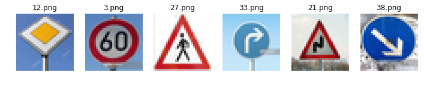
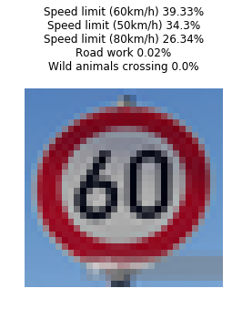

# Self-Driving Car Engineer Nanodegree

## Project: Build a Traffic Sign Recognition Classifier

---
## Step 0: Load The Data


```python
# Load pickled data
import pickle
import numpy as np

# TODO: Fill this in based on where you saved the training and testing data

training_file = "data-set/train.p"
validation_file="data-set/valid.p"
testing_file = "data-set/test.p"

with open(training_file, mode='rb') as f:
    train = pickle.load(f)
with open(validation_file, mode='rb') as f:
    valid = pickle.load(f)
with open(testing_file, mode='rb') as f:
    test = pickle.load(f)
    
X_train_orig, y_train_orig = train['features'], train['labels']
X_valid_orig, y_valid_orig = valid['features'], valid['labels']
X_test_orig, y_test_orig = test['features'], test['labels']

print (len(X_train_orig),len(y_train_orig))
print (X_valid_orig[0].shape)
```

    34799 34799
    (32, 32, 3)


---

## Step 1: Dataset Summary & Exploration

The size of training set is 34799  
The size of the validation set is 4410  
The size of test set is 12630  
The shape of a traffic sign image is (32, 32, 3)  
The number of unique classes/labels in the data set is 43  

### Provide a Basic Summary of the Data Set Using Python, Numpy and/or Pandas


```python
### Data exploration visualization code goes here.
### Feel free to use as many code cells as needed.

n_train = X_train_orig.shape[0]
n_validation = X_valid_orig.shape[0]
n_test = X_test_orig.shape[0]

image_shape = (X_train_orig.shape[1:4])
n_classes = np.unique(y_train_orig).size

print("Number of training examples =", n_train)
print("Number of validation examples =", n_validation)
print("Number of testing examples =", n_test)
print("Image data shape =", image_shape)
print("Number of classes =", n_classes)
```

    Number of training examples = 34799
    Number of validation examples = 4410
    Number of testing examples = 12630
    Image data shape = (32, 32, 3)
    Number of classes = 43


### Include an exploratory visualization of the dataset

Here is an exploratory visualization of the data set.


```python
### Data exploration visualization code goes here.
### Feel free to use as many code cells as needed.
import matplotlib.pyplot as plt
import random

# Visualizations will be shown in the notebook.
%matplotlib inline
plt.figure(figsize=(image_shape[0]/3,image_shape[1]/3))
counts=[0]*n_classes
for i in range(0, n_classes):
    plt.subplot(6, 8, i+1)
    pics = X_train_orig[y_train_orig == i]
    index = random.randint(0, len(pics))
    plt.imshow(pics[index].squeeze())
    plt.title(i)
    plt.axis('off')
    counts[i]=len(pics)
plt.show()

plt.figure(figsize=(10,3))
plt.bar(range(0, n_classes), counts)
plt.title("Count of each sign")
plt.xlabel("Traffic sign index")
plt.ylabel("Size")
plt.show()
```


----

## Step 2: Design and Test a Model Architecture
### Pre-process the Data Set 
The image data is normalized so that the data has mean zero and equal variance. The following equation is used to normalize the images   
`(pixel - 128)/ 128`


```python
### Preprocessing

from sklearn.model_selection import train_test_split
from sklearn import preprocessing
from sklearn.utils import shuffle
def normalize(data):
    return (data - 128.) / 128.

def label_binarizer(labels):
    lb = preprocessing.LabelBinarizer()
    lb.fit(labels)
    return lb

def preprocess(x_train, y_train, x_test, y_test):
    # Normalize
    x_train = normalize(x_train)
    x_test = normalize(x_test)
    
    
    # One hot encode labels
    lb = label_binarizer(y_train)
    y_train = lb.transform(y_train)
    y_test = lb.transform(y_test)
    
    # Split training set to training and validation
    x_train, x_val, y_train, y_val = \
        train_test_split(x_train, y_train, 
                         test_size=0.33, stratify = y_train ) 
    return x_train, y_train, x_test, y_test, x_val, y_val

X_train, y_train, X_test, y_test, X_val, y_val = \
preprocess(X_train_orig, y_train_orig, \
           X_test_orig, y_test_orig)

print("X_train \t y_train \t X_val \t\t y_val \t\t X_test \t y_test")
print(X_train_orig.shape,y_train.shape,\
      X_valid_orig.shape,y_valid_orig.shape,\
      X_test_orig.shape, y_test_orig.shape)
print(X_train.shape,y_train.shape,\
      X_val.shape,y_val.shape,\
      X_test.shape, y_test.shape)
```

    X_train 	 y_train 	 X_val 		 y_val 		 X_test 	 y_test
    (34799, 32, 32, 3) (23315, 43) (4410, 32, 32, 3) (4410,) (12630, 32, 32, 3) (12630,)
    (23315, 32, 32, 3) (23315, 43) (11484, 32, 32, 3) (11484, 43) (12630, 32, 32, 3) (12630, 43)


### Model Architecture

My final model consisted of the following layers:

| Layer         		|     Description	        					| 
|:---------------------:|:---------------------------------------------:| 
| Input         		| 32x32x3 RGB image   							| 
| Convolution 5x5     	| 3x3 stride, VALID padding, outputs 28x28x6 	|
| RELU					|												|
| Dropout				| 50%											|
| Max pooling	      	| 2x2 stride,  outputs 14x14x6 					|
| Convolution 5x5     	| 3x3 stride, VALID padding, outputs 10x10x16 	|
| RELU					|												|
| Dropout				| 50%											|
| Max pooling	      	| 2x2 stride,  outputs 5x15x6 					|
| Flatten				| outputs 400  									|
| Fully connected		| outputs 120  									|
| RELU					|												|
| Dropout				| 50%											|
| Fully connected		| outputs 43  									|
| Softmax				|             									|


```python
### Define your architecture here.
### Feel free to use as many code cells as needed.

from tensorflow.contrib.layers import flatten
import tensorflow as tf

def LeNet(x, keep_prob): 
    # Arguments used for tf.truncated_normal, randomly defines variables for the weights and biases for each layer
    mu = 0
    sigma = 0.01
    
    # Layer 1: Convolutional. Input = 32x32x1. Output = 28x28x6.
    conv1_W = tf.Variable(tf.truncated_normal(shape=(5, 5, 3, 6), mean = mu, stddev = sigma))
    conv1_b = tf.Variable(tf.zeros(6))
    conv1   = tf.nn.conv2d(x, conv1_W, strides=[1, 1, 1, 1], padding='VALID') + conv1_b

    # Activation.
    conv1 = tf.nn.relu(conv1)
    conv1 = tf.nn.dropout(conv1, keep_prob)

    # Pooling. Input = 28x28x6. Output = 14x14x6.
    conv1 = tf.nn.max_pool(conv1, ksize=[1, 2, 2, 1], strides=[1, 2, 2, 1], padding='VALID')

    # Layer 2: Convolutional. Output = 10x10x16.
    conv2_W = tf.Variable(tf.truncated_normal(shape=(5, 5, 6, 16), mean = mu, stddev = sigma))
    conv2_b = tf.Variable(tf.zeros(16))
    conv2   = tf.nn.conv2d(conv1, conv2_W, strides=[1, 1, 1, 1], padding='VALID') + conv2_b
    
    # Activation.
    conv2 = tf.nn.relu(conv2)
    conv2 = tf.nn.dropout(conv2, keep_prob)

    # Pooling. Input = 10x10x16. Output = 5x5x16.
    conv2 = tf.nn.max_pool(conv2, ksize=[1, 2, 2, 1], strides=[1, 2, 2, 1], padding='VALID')

    # Flatten. Input = 5x5x16. Output = 400.
    fc0   = flatten(conv2)
    
    # Layer 3: Fully Connected. Input = 400. Output = 120.
    fc1_W = tf.Variable(tf.truncated_normal(shape=(400, 120), mean = mu, stddev = sigma))
    fc1_b = tf.Variable(tf.zeros(120))
    fc1   = tf.matmul(fc0, fc1_W) + fc1_b
    
    # Activation.
    fc1    = tf.nn.relu(fc1)
    fc1 = tf.nn.dropout(fc1, keep_prob)

    # Layer 4: Fully Connected. Input = 120. Output = 43.
    fc2_W  = tf.Variable(tf.truncated_normal(shape=(120, n_classes), mean = mu, stddev = sigma))
    fc2_b  = tf.Variable(tf.zeros(n_classes))
    logits = tf.matmul(fc1, fc2_W) + fc2_b
    
    return logits
```


```python
x = tf.placeholder(tf.float32, (None, 32, 32, 3))
y = tf.placeholder(tf.float32, (None, n_classes))
keep_prob = tf.placeholder(tf.float32)

logits = LeNet(x,keep_prob)

loss_op = tf.reduce_mean(tf.nn.softmax_cross_entropy_with_logits(logits, y))
opt = tf.train.AdamOptimizer(learning_rate=0.001) 
train_op = opt.minimize(loss_op)
correct_prediction = tf.equal(tf.argmax(logits, 1), tf.argmax(y, 1))
accuracy_op = tf.reduce_mean(tf.cast(correct_prediction, tf.float32))
saver = tf.train.Saver()
```


```python
def next_batch(x_data, y_data, batch_size, step):
    batch_start = step*batch_size
    batch_x = x_data[batch_start:batch_start + batch_size]
    batch_y = y_data[batch_start:batch_start + batch_size]
    return batch_x, batch_y

def eval_data(X_data, y_data):
    num_examples = len(X_data)
    total_accuracy = 0
    total_loss = 0
    sess = tf.get_default_session()
    for offset in range(0, num_examples, BATCH_SIZE):
        batch_x, batch_y = X_data[offset:offset+BATCH_SIZE], y_data[offset:offset+BATCH_SIZE]
        loss,accuracy = sess.run([loss_op,accuracy_op], \
                            feed_dict={x: batch_x, y: batch_y, keep_prob: 1.0})
        total_accuracy += (accuracy * len(batch_x))
        total_loss += (loss * len(batch_x))
    return total_loss / num_examples, total_accuracy / num_examples
```

### Train, Validate and Test the Model

validation set accuracy of 0.961
test set accuracy of 0.895


```python
EPOCHS = 15
BATCH_SIZE = 50

prob_step=(1.0-0.5)/EPOCHS
prob=1.0
with tf.Session() as sess:
    sess.run(tf.global_variables_initializer())
    steps_per_epoch = len(X_train) // BATCH_SIZE
    num_examples = steps_per_epoch * BATCH_SIZE

    for i in range(EPOCHS):
        for step in range(steps_per_epoch):
            batch_x, batch_y = next_batch(X_train, y_train, BATCH_SIZE, step)
            loss = sess.run(train_op, \
                            feed_dict={x: batch_x, y: batch_y, keep_prob: prob})

        val_loss, val_acc = eval_data(X_val, y_val)
        print("EPOCH {} keep_prob {:.2f} loss = {:.3f} accuracy = {:.3f}".
              format(i+1,prob, val_loss, val_acc))
        prob-=prob_step
        saver.save(sess, './lenet')
        
    # Evaluate on the test data
    test_loss, test_acc = eval_data(X_test, y_test)
    print()
    print("Testing model loss = {:.3f} accuracy = {:.3f}".format(test_loss, test_acc))
```

    EPOCH 1 keep_prob 1.00 loss = 1.568 accuracy = 0.495
    EPOCH 2 keep_prob 0.97 loss = 0.719 accuracy = 0.783
    EPOCH 3 keep_prob 0.93 loss = 0.404 accuracy = 0.889
    EPOCH 4 keep_prob 0.90 loss = 0.273 accuracy = 0.933
    EPOCH 5 keep_prob 0.87 loss = 0.216 accuracy = 0.948
    EPOCH 6 keep_prob 0.83 loss = 0.194 accuracy = 0.955
    EPOCH 7 keep_prob 0.80 loss = 0.170 accuracy = 0.966
    EPOCH 8 keep_prob 0.77 loss = 0.182 accuracy = 0.963
    EPOCH 9 keep_prob 0.73 loss = 0.180 accuracy = 0.971
    EPOCH 10 keep_prob 0.70 loss = 0.195 accuracy = 0.974
    EPOCH 11 keep_prob 0.67 loss = 0.219 accuracy = 0.971
    EPOCH 12 keep_prob 0.63 loss = 0.226 accuracy = 0.968
    EPOCH 13 keep_prob 0.60 loss = 0.277 accuracy = 0.973
    EPOCH 14 keep_prob 0.57 loss = 0.273 accuracy = 0.971
    EPOCH 15 keep_prob 0.53 loss = 0.344 accuracy = 0.968
    
    Testing model loss = 0.529 accuracy = 0.890


```python
# Evaluate again for comparing multiple runs
with tf.Session() as sess:
    saver.restore(sess, tf.train.latest_checkpoint('.'))
    test_loss, test_acc = eval_data(X_test, y_test)
    print()
    print("Testing model loss = {:.3f} accuracy = {:.3f}".format(test_loss, test_acc))
```

---

## Step 3: Test a Model on New Images

I also tested the model on [official GTSRB test set](http://benchmark.ini.rub.de/?section=gtsrb&subsection=dataset#Downloads), which more than 10,000 pictures. I only selected the first 1000 pictures as it takes a long time to run through all the data. The prediction accuracy is 0.864.

### Load and Output the Images


```python
### Load the images and plot them here.
### Feel free to use as many code cells as needed.
import os
import matplotlib.image as mpimg
import PIL
from PIL import Image

path = "new-data-set/"
files = [file for file in os.listdir(path) if file.endswith('.png')]
signs = np.empty((0,32,32,3))
file_num=len(files)

plt.figure(figsize=(12,12))
image_list=[]
for i in range(0,file_num):
    img = Image.open(path + files[i])
    img_resized = img.resize((32,32), PIL.Image.ANTIALIAS)
    image_list.append(img_resized)
    img_array=np.array(img_resized.getdata()).\
                reshape(img_resized.size[0], img_resized.size[1], 3)
    signs = np.append(signs, [img_array], axis=0)
    plt.subplot(1, 6, i+1)
    plt.title(files[i])
    plt.imshow(img_resized)
    plt.axis('off')
    
print("Loaded ",file_num, "files")
plt.show()
```

    Loaded  6 files





### Predict the Sign Type for Each Image


```python
### Run the predictions here and use the model to output the prediction for each image.
### Make sure to pre-process the images with the same pre-processing pipeline used earlier.
### Feel free to use as many code cells as needed.
csv_data = np.genfromtxt('signnames.csv', delimiter=',', names=True, dtype=None)
sign_names = [t[1].decode('utf-8') for t in csv_data]

signs_norm = normalize(signs)
predicions = tf.argmax(logits,1)
predicted_classes = []

with tf.Session() as sess:
    saver.restore(sess, tf.train.latest_checkpoint('.'))
    predicted_classes = sess.run(predicions, feed_dict={x: signs_norm, keep_prob: 1.0})

print("Tested against ",len(predicted_classes),"files")
plt.figure(figsize=(image_shape[0]/2,image_shape[1]/2))
for i in range(0,file_num):
    plt.subplot(7, 3, i+1)
    plt.title(sign_names[predicted_classes[i]])
    plt.axis('off')
    plt.imshow(image_list[i])
plt.show()
```

    Tested against  6 files


### Analyze Performance


```python
### Calculate the accuracy for these 5 new images. 
### For example, if the model predicted 1 out of 5 signs correctly, it's 20% accurate on these new images.
correct_predicts=0
for predict,file in zip(predicted_classes,files):
    label = os.path.splitext(file)[0]
    if predict==int(label):
        correct_predicts+=1
        
print()
print("Correct predict: ",correct_predicts)
print("Total test: ",file_num)
print("Accuracy: ",1.0* correct_predicts/file_num)
```

    
    Correct predict:  4
    Total test:  6
    Accuracy:  0.6666666666666666


### Output Top 5 Softmax Probabilities For Each Image


```python
##### Print out the top five softmax probabilities for the predictions on the German traffic sign images found on the web. 
### Feel free to use as many code cells as needed.
probs_op = tf.nn.softmax(logits)
top_k_op = tf.nn.top_k(probs_op, k=5)
top_k = []
with tf.Session() as sess:
    saver.restore(sess, tf.train.latest_checkpoint('.'))
    top_k = sess.run(top_k_op, feed_dict={x: signs_norm, keep_prob: 1.0})
prob_values, class_labels = top_k[0], top_k[1]

for i in range(0,file_num):
    title=''
    for certainty, label in zip(prob_values[i], class_labels[i]):
        title += sign_names[label] + ' ' + \
                    str(round(certainty* 100., 2)) + '%\n'
    plt.title(title)
    plt.axis('off')
    plt.imshow(image_list[i])
    plt.show()
```





```python

```
